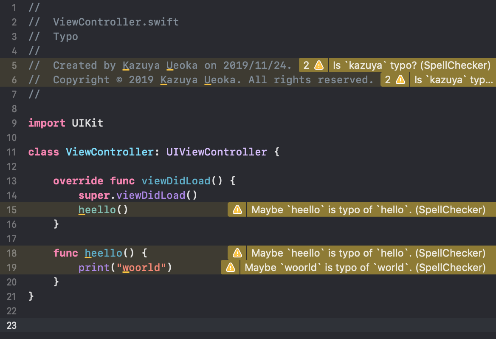

#  SpellChecker for Xcode




## Recommended environment

- Swift 5.1
- Xcode 11.2.1
- macOS 10.15

## Install

```shellscript
git clone git@github.com:fromkk/SpellChecker.git
cd ./SpellChecker
make install
```

## Usage

Write to your `Run script` like a below code.

```shellscript
if ! [ -f /usr/local/bin/SpellChecker ]; then
    echo "SpellChecker not installed"
    exit 0
fi

git_path=/usr/local/bin/git
files=$($git_path diff --diff-filter=d --name-only -- "*.swift" "*.h" "*.m")
if (test -z $files) || (test ${#files[@]} -eq 0); then
  echo "no files changed."
  exit 0
fi

options=""
for file in $files
do
  options="$options $SRCROOT/$file"
done

/usr/local/bin/SpellChecker -- $options

```

### Whitelist

If you want ignore some warnings, make YAML file to your directory.  
For example:

```yaml
whiteList:
  - kazuya
  - ueoka
  - fromkk
```

And set `--yml` options.

```shellscript
/usr/local/bin/SpellChecker --yml $SRCROOT/swift-keywords.yaml -- $options
```

